# Design Document: Shopify Clone SaaS Platform

## Overview

This document defines the technical architecture for a multi-tenant E-commerce SaaS and Whitelabel Store Platform. The system enables merchants to create custom storefronts, manage products, access CRM tools, install plugins, apply themes, and whitelabel their operations via mobile applications.

The architecture follows a bounded-context microservices approach with event-driven communication, deployed on Kubernetes with multi-region capability. A key design constraint is the **prototype-first strategy** (Requirement 36): the system is built as a simplified single-server monolith first for investor demonstration, then refactored to production-grade distributed architecture after funding confirmation.

### Design Principles

1. **Prototype-first, production-ready contracts**: API contracts and data models are designed for production from day one; only infrastructure and isolation mechanisms are simplified in prototype phase.
2. **Strict tenant isolation**: Row-Level Security (RLS) at database layer, storage partitioning, and request-scoped tenant context propagation.
3. **Event-driven decoupling**: Domain events form the backbone of inter-service communication, enabling independent scaling and deployment.
4. **Progressive complexity**: Architecture layers are additive — prototype → single-region production → multi-region HA.

### Technology Stack

| Layer | Technology | Rationale |
|-------|-----------|-----------|
| Web Frontend | Next.js 15 (App Router) | SSR/streaming, React Server Components, performance |
| Mobile | React Native / Expo | Cross-platform, EAS Build + OTA updates |
| Admin API | Node.js/TypeScript (Fastify) | Developer velocity, type safety, JSON-native |
| Storefront API | Node.js/TypeScript (Apollo Federation) | GraphQL federation, schema stitching |
| Internal Services | Go | Performance-critical paths (inventory, billing) |
| Database | PostgreSQL (Aurora) | RLS, ACID, managed scaling |
| Cache | Redis (ElastiCache) | Session, cart, rate limiting |
| Search | OpenSearch / Elasticsearch | Full-text search, faceted filtering |
| Message Broker | Kafka (MSK) / SQS+SNS | Event-driven backbone, tenant-partitioned topics |
| Object Storage | S3 + CloudFront CDN | Tenant-isolated asset storage |
| Container Orchestration | Kubernetes (EKS) | HPA, multi-AZ, service mesh |
| IaC | Terraform | Reproducible infrastructure |
| CI/CD | GitHub Actions + ArgoCD | GitOps deployment |
| Observability | OpenTelemetry + Prometheus + Grafana | Distributed tracing, metrics, alerting |

---

## Architecture

### System Context (C4 Level 1)

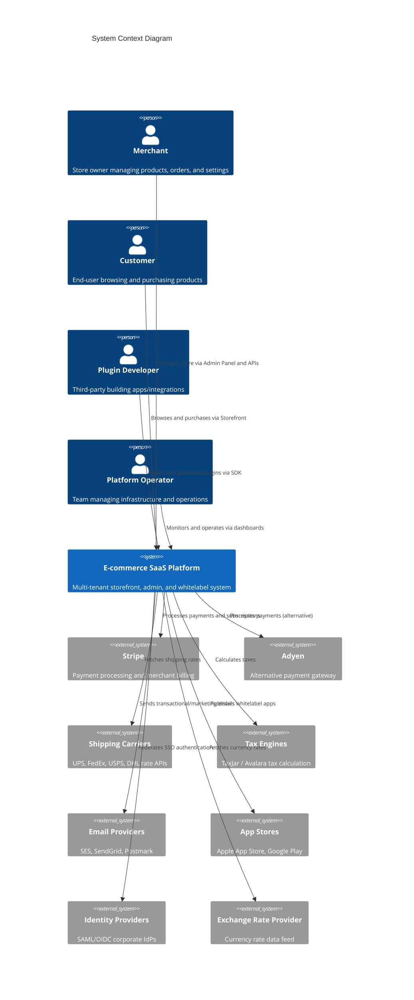

### Container Diagram (C4 Level 2)

```mermaid
C4Container
    title Container Diagram

    Person(merchant, "Merchant")
    Person(customer, "Customer")

    System_Boundary(platform, "E-commerce SaaS Platform") {
        Container(gateway, "API Gateway", "Kong/Envoy", "Auth, rate limiting, routing")
        Container(admin_web, "Admin Panel", "Next.js 15", "Merchant management UI")
        Container(storefront_web, "Web Storefront", "Next.js 15", "Customer shopping experience")
        Container(mobile_app, "Whitelabel Mobile App", "React Native/Expo", "Branded mobile storefront")

        Container(storefront_api, "Storefront API", "Apollo Federation/Node.js", "GraphQL federated schema")
        Container(admin_api, "Admin API", "Fastify/Node.js", "REST API for admin operations")
        Container(auth_service, "Auth Service", "Node.js", "OAuth2, JWT, RBAC, SSO")
        Container(product_service, "Product Service", "Go", "Catalog, variants, inventory")
        Container(order_service, "Order Service", "Go", "Orders, fulfillment, checkout")
        Container(cart_service, "Cart Service", "Node.js + Redis", "Cart management, stock reservation")
        Container(payment_service, "Payment Service", "Go", "PCI-DSS payment processing")
        Container(crm_service, "CRM Service", "Node.js", "Customer profiles, segments")
        Container(notification_service, "Notification Service", "Node.js", "Email, push, SMS")
        Container(billing_service, "Billing Service", "Go", "Subscriptions, invoicing")
        Container(analytics_service, "Analytics Service", "Node.js", "Events, dashboards, reports")
        Container(asset_service, "Asset Service", "Go", "Media upload, transform, CDN")
        Container(webhook_service, "Webhook Service", "Node.js", "Event delivery to external endpoints")
        Container(search_service, "Search Service", "Node.js + OpenSearch", "Full-text search, facets")
        Container(theme_service, "Theme Service", "Node.js", "Theme management, rendering")
        Container(plugin_service, "Plugin Service", "Go", "Extension sandbox, marketplace")
        Container(whitelabel_service, "Whitelabel Service", "Node.js", "Mobile build pipeline, OTA")
        Container(control_plane, "Control Plane", "Go", "Tenant provisioning, domain routing")
        Container(promotion_service, "Promotion Engine", "Go", "Discounts, coupons, rules")
        Container(shipping_tax_service, "Shipping & Tax Service", "Node.js", "Rate calculation, tax compliance")

        ContainerDb(postgres, "PostgreSQL Aurora", "Primary database with RLS")
        ContainerDb(redis, "Redis Cluster", "Cache, sessions, rate limits")
        ContainerDb(opensearch, "OpenSearch", "Product search index")
        ContainerDb(s3, "S3", "Tenant-isolated asset storage")
        Container(kafka, "Kafka / SQS", "Message broker for domain events")
    }

    Rel(merchant, admin_web, "Manages store")
    Rel(customer, storefront_web, "Shops online")
    Rel(customer, mobile_app, "Shops on mobile")
    Rel(admin_web, gateway, "API calls")
    Rel(storefront_web, gateway, "GraphQL queries")
    Rel(mobile_app, gateway, "GraphQL queries")
    Rel(gateway, storefront_api, "Routes storefront traffic")
    Rel(gateway, admin_api, "Routes admin traffic")
```

### Bounded Contexts

The system is decomposed into the following bounded contexts, each owning its data and exposing APIs:

| Bounded Context | Services | Data Store | Key Responsibility |
|----------------|----------|------------|-------------------|
| **Identity & Access** | Auth Service | PostgreSQL (auth schema) | Authentication, authorization, RBAC |
| **Storefront** | Storefront API, Theme Service | PostgreSQL + Redis | Customer-facing data, themes |
| **Catalog** | Product Service, Search Service | PostgreSQL + OpenSearch | Products, variants, categories |
| **Commerce** | Cart Service, Order Service, Payment Service | PostgreSQL + Redis | Cart, checkout, payments, fulfillment |
| **Promotions** | Promotion Engine | PostgreSQL | Discounts, coupons, rules |
| **CRM** | CRM Service | PostgreSQL | Customer profiles, segments |
| **Billing** | Billing Service | PostgreSQL | Subscriptions, invoicing |
| **Media** | Asset Service | PostgreSQL + S3 | Upload, transform, serve |
| **Notifications** | Notification Service | PostgreSQL + Redis | Email, push, SMS delivery |
| **Analytics** | Analytics Service | PostgreSQL + ClickHouse | Events, dashboards, reports |
| **Extensions** | Plugin Service, Webhook Service | PostgreSQL | Marketplace, sandbox, webhooks |
| **Whitelabel** | Whitelabel Service | PostgreSQL + S3 | Mobile build pipeline, OTA |
| **Control Plane** | Control Plane | PostgreSQL | Tenant provisioning, domains, routing |
| **Logistics** | Shipping & Tax Service | PostgreSQL + Redis | Rates, tax calculation, fulfillment routing |

---

## Components and Interfaces

### API Gateway

The API Gateway (Kong or Envoy-based) serves as the single entry point for all external traffic.

**Responsibilities:**
- OAuth2 token validation (< 50ms p99) — Requirement 35.1
- Per-merchant rate limiting with sliding window — Requirement 35.3
- URL-path routing with API version resolution — Requirement 35.5
- Request/response transformation for backward compatibility — Requirement 35.7
- Correlation ID injection for distributed tracing — Requirement 35.8
- Circuit breaking for backend unavailability — Requirement 35.6

**Rate Limit Tiers:**
```
Free:         100 rpm
Basic:        500 rpm
Professional: 2000 rpm
Enterprise:   10000 rpm
```

### Storefront API (GraphQL — Apollo Federation)

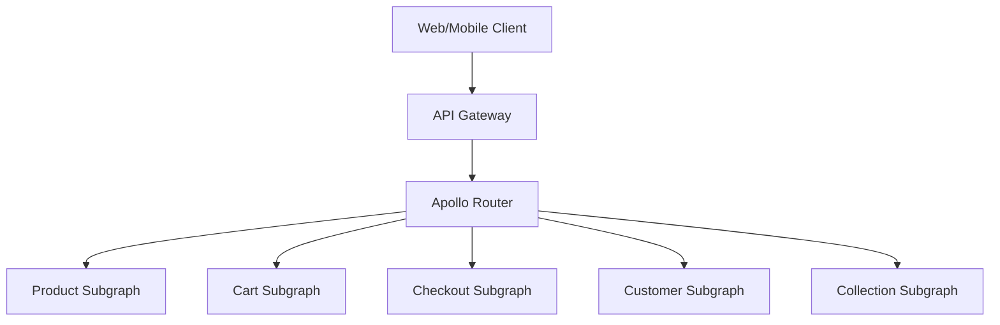

**Schema Design:**
- Federated subgraphs: Product, Cart, Checkout, Customer, Collection
- Query depth limit: 10 levels — Requirement 8.3
- Complexity scoring: max 1000 points — Requirement 8.3
- Cursor-based pagination: default 20, max 100 — Requirement 8.4
- Cache invalidation within 2 seconds of data change — Requirement 8.5
- P95 latency < 50ms, P99 < 150ms at 500 concurrent connections — Requirement 8.2

### Admin API (REST — Fastify)

**Design:**
- OpenAPI 3.0 specification for all endpoints — Requirement 9.1
- URL path versioning (`/v1/`, `/v2/`) — Requirement 9.5
- Rate limiting: 1000 rpm, burst 100 rps — Requirement 9.3
- P95 < 150ms, P99 < 350ms — Requirement 9.2
- Structured error responses with error code, message, request ID — Requirement 9.7
- API key authentication on all requests — Requirement 9.6

### Internal Communication (gRPC)

**Design:**
- Protocol Buffers with shared schema registry — Requirement 30.2
- mTLS enforcement on all inter-service connections — Requirement 30.3
- Circuit breaker: 5 failures → open, 30s recovery — Requirement 30.5
- Configurable deadline: default 5 seconds — Requirement 30.7
- OpenTelemetry context propagation via gRPC metadata — Requirement 30.8

### Control Plane

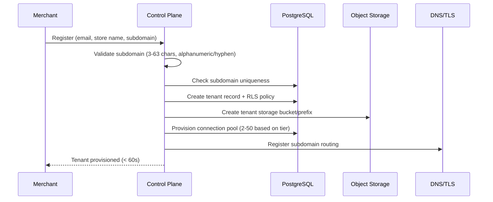

**Tenant Provisioning (Requirement 1):**
- Isolated schema with RLS policies
- Dedicated S3 prefix (`s3://assets/{tenant_id}/`)
- Connection pool allocation (2–50 connections per tier)
- Subdomain validation: 3–63 lowercase alphanumeric/hyphen, start/end alphanumeric
- Rollback on partial failure — Requirement 1.7

**Custom Domain Management (Requirement 26):**
- DNS TXT record verification (< 5 minutes)
- Auto-provisioned TLS via Let's Encrypt/ACM
- SNI-based routing with p99 < 10ms lookup
- Multiple domains per storefront (primary + redirects)

### Plugin Extension Sandbox

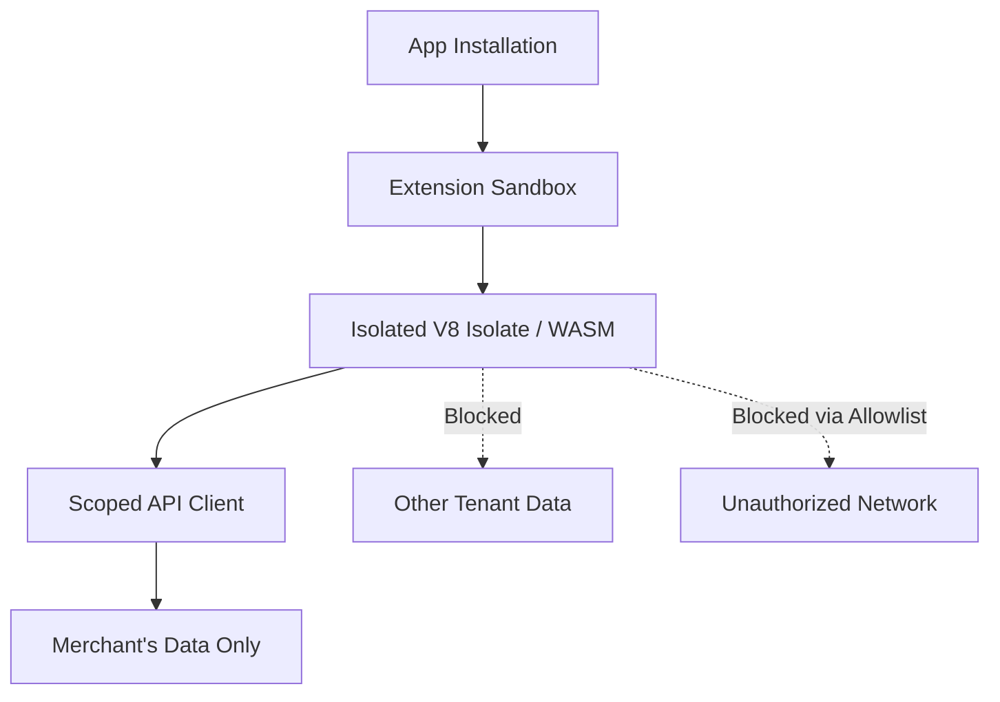

**Execution Model (Requirements 5, 12.6):**
- V8 Isolates (Cloudflare Workers-style) or WebAssembly sandboxes
- CPU/memory limits enforced; violations terminate execution — Requirement 5.4
- Network egress restricted to merchant-approved allowlist — Requirement 12.6
- Event hooks invoked within 500ms — Requirement 5.3
- No cross-tenant data access at sandbox level — Requirement 5.2
- Typed Plugin SDK exposing product, order, customer, storefront events — Requirement 5.5

### Whitelabel Mobile Build Pipeline

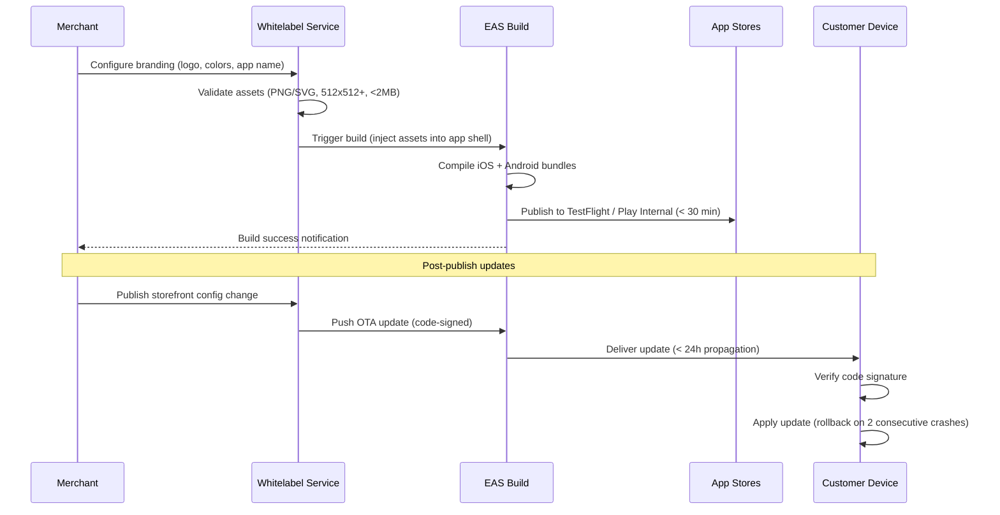

**Build Pipeline (Requirement 10):**
- Asset validation: logo PNG/SVG ≤ 2MB, 512×512+ px; app name 3–30 chars; ≤ 6 colors; splash ≤ 5MB
- EAS Build compilation to TestFlight + Play Internal Testing within 30 minutes
- Automatic retry on failure; diagnostic report within 5 minutes
- OTA updates via EAS Update (code-signed, ≤ 50MB bundles)
- Staged rollout: 1% → 10% → 50% → 100% — Requirement 31.5
- Auto-rollback on 2 consecutive crash launches — Requirement 31.4
- Tenant-scoped OTA delivery — Requirement 31.2

### Promotion Engine

**Discount Types (Requirement 23):**
- Percentage-off (1–100%)
- Fixed-amount (0.01–999,999.99)
- Buy-X-Get-Y
- Free shipping

**Evaluation Pipeline:**
```
Cart → Eligibility Check (conditions) → Rule Application → Stacking Resolution → Final Price
```

- Conditions: min cart value, specific products, customer segments, date ranges
- Coupon validation: case-insensitive, 3–32 alphanumeric, < 200ms — Requirement 23.3
- Stacking: merchant-configured (best-only or combinable), default best-only
- Usage limits: per-coupon total and per-customer

### Checkout Flow

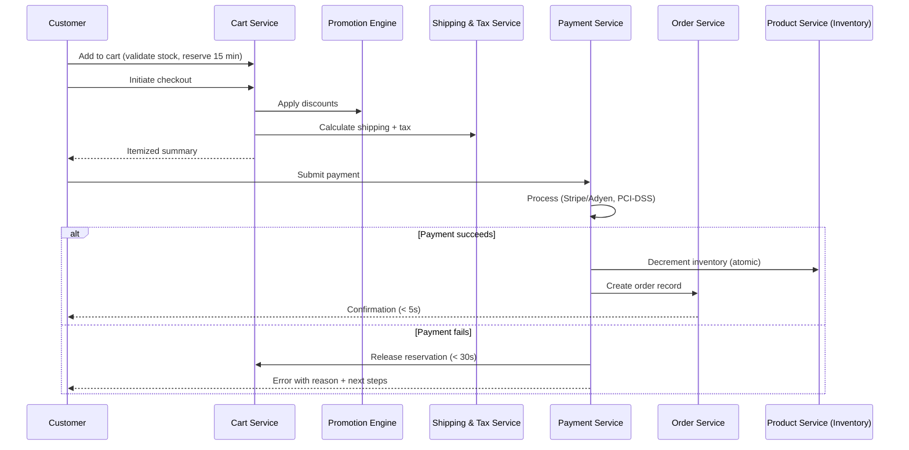

---

## Data Models

### Multi-Tenancy Pattern

All tenant-scoped tables include a `tenant_id` column with RLS policies:

```sql
-- RLS Policy Pattern (Production)
CREATE POLICY tenant_isolation ON products
    USING (tenant_id = current_setting('app.current_tenant')::uuid);

-- Set tenant context per request
SET app.current_tenant = '<merchant_uuid>';
```

**Prototype Simplification:** Single-tenant schema without RLS; `tenant_id` column present but policies not enforced (Requirement 36.7).

### Core Schema

```sql
-- Tenants / Merchants
CREATE TABLE tenants (
    id UUID PRIMARY KEY DEFAULT gen_random_uuid(),
    name VARCHAR(255) NOT NULL,
    subdomain VARCHAR(63) NOT NULL UNIQUE,
    custom_domain VARCHAR(255),
    subscription_tier VARCHAR(20) NOT NULL DEFAULT 'free',
    status VARCHAR(20) NOT NULL DEFAULT 'active',
    settings JSONB DEFAULT '{}',
    created_at TIMESTAMPTZ NOT NULL DEFAULT NOW(),
    updated_at TIMESTAMPTZ NOT NULL DEFAULT NOW()
);

-- Products
CREATE TABLE products (
    id UUID PRIMARY KEY DEFAULT gen_random_uuid(),
    tenant_id UUID NOT NULL REFERENCES tenants(id),
    title VARCHAR(255) NOT NULL,
    description TEXT CHECK (length(description) <= 10000),
    status VARCHAR(20) NOT NULL DEFAULT 'draft',
    category_id UUID REFERENCES categories(id),
    metadata JSONB DEFAULT '{}',
    created_at TIMESTAMPTZ NOT NULL DEFAULT NOW(),
    updated_at TIMESTAMPTZ NOT NULL DEFAULT NOW()
);

-- Listings (Product Variants)
CREATE TABLE listings (
    id UUID PRIMARY KEY DEFAULT gen_random_uuid(),
    tenant_id UUID NOT NULL REFERENCES tenants(id),
    product_id UUID NOT NULL REFERENCES products(id),
    sku VARCHAR(64) NOT NULL,
    price DECIMAL(12,2) NOT NULL CHECK (price BETWEEN 0.01 AND 999999999.99),
    weight_grams INTEGER CHECK (weight_grams BETWEEN 0 AND 1000000),
    inventory_quantity INTEGER NOT NULL DEFAULT 0 CHECK (inventory_quantity BETWEEN 0 AND 999999),
    options JSONB DEFAULT '{}',
    status VARCHAR(20) NOT NULL DEFAULT 'active',
    created_at TIMESTAMPTZ NOT NULL DEFAULT NOW(),
    updated_at TIMESTAMPTZ NOT NULL DEFAULT NOW(),
    UNIQUE(tenant_id, sku)
);

-- Categories (Hierarchical, max 5 levels)
CREATE TABLE categories (
    id UUID PRIMARY KEY DEFAULT gen_random_uuid(),
    tenant_id UUID NOT NULL REFERENCES tenants(id),
    parent_id UUID REFERENCES categories(id),
    name VARCHAR(128) NOT NULL,
    depth INTEGER NOT NULL CHECK (depth BETWEEN 0 AND 4),
    path LTREE NOT NULL,
    created_at TIMESTAMPTZ NOT NULL DEFAULT NOW()
);

-- Orders
CREATE TABLE orders (
    id UUID PRIMARY KEY DEFAULT gen_random_uuid(),
    tenant_id UUID NOT NULL REFERENCES tenants(id),
    customer_id UUID NOT NULL REFERENCES customers(id),
    status VARCHAR(20) NOT NULL DEFAULT 'pending',
    subtotal DECIMAL(12,2) NOT NULL,
    tax_amount DECIMAL(12,2) NOT NULL DEFAULT 0,
    shipping_amount DECIMAL(12,2) NOT NULL DEFAULT 0,
    discount_amount DECIMAL(12,2) NOT NULL DEFAULT 0,
    total DECIMAL(12,2) NOT NULL,
    currency VARCHAR(3) NOT NULL,
    settlement_currency VARCHAR(3) NOT NULL,
    settlement_rate DECIMAL(12,6),
    shipping_address JSONB NOT NULL,
    billing_address JSONB,
    payment_id VARCHAR(255),
    payment_method VARCHAR(50),
    notes TEXT,
    created_at TIMESTAMPTZ NOT NULL DEFAULT NOW(),
    updated_at TIMESTAMPTZ NOT NULL DEFAULT NOW()
);

-- Order Line Items
CREATE TABLE order_line_items (
    id UUID PRIMARY KEY DEFAULT gen_random_uuid(),
    order_id UUID NOT NULL REFERENCES orders(id),
    tenant_id UUID NOT NULL REFERENCES tenants(id),
    listing_id UUID NOT NULL REFERENCES listings(id),
    quantity INTEGER NOT NULL CHECK (quantity > 0),
    unit_price DECIMAL(12,2) NOT NULL,
    total_price DECIMAL(12,2) NOT NULL,
    fulfillment_status VARCHAR(20) DEFAULT 'pending',
    fulfillment_group_id UUID,
    created_at TIMESTAMPTZ NOT NULL DEFAULT NOW()
);

-- Customers
CREATE TABLE customers (
    id UUID PRIMARY KEY DEFAULT gen_random_uuid(),
    tenant_id UUID NOT NULL REFERENCES tenants(id),
    email VARCHAR(320) NOT NULL,
    name VARCHAR(255),
    total_orders INTEGER NOT NULL DEFAULT 0,
    total_spend DECIMAL(12,2) NOT NULL DEFAULT 0,
    average_order_value DECIMAL(12,2) NOT NULL DEFAULT 0,
    last_purchase_date TIMESTAMPTZ,
    tags TEXT[] DEFAULT '{}',
    metadata JSONB DEFAULT '{}',
    anonymized BOOLEAN NOT NULL DEFAULT FALSE,
    created_at TIMESTAMPTZ NOT NULL DEFAULT NOW(),
    updated_at TIMESTAMPTZ NOT NULL DEFAULT NOW(),
    UNIQUE(tenant_id, email)
);

-- Inventory Locations
CREATE TABLE inventory_locations (
    id UUID PRIMARY KEY DEFAULT gen_random_uuid(),
    tenant_id UUID NOT NULL REFERENCES tenants(id),
    name VARCHAR(255) NOT NULL,
    address JSONB NOT NULL,
    coordinates POINT,
    is_active BOOLEAN NOT NULL DEFAULT TRUE,
    created_at TIMESTAMPTZ NOT NULL DEFAULT NOW()
);

-- Inventory per Location
CREATE TABLE inventory_levels (
    id UUID PRIMARY KEY DEFAULT gen_random_uuid(),
    tenant_id UUID NOT NULL REFERENCES tenants(id),
    listing_id UUID NOT NULL REFERENCES listings(id),
    location_id UUID NOT NULL REFERENCES inventory_locations(id),
    available INTEGER NOT NULL DEFAULT 0,
    reserved INTEGER NOT NULL DEFAULT 0,
    incoming INTEGER NOT NULL DEFAULT 0,
    updated_at TIMESTAMPTZ NOT NULL DEFAULT NOW(),
    UNIQUE(listing_id, location_id)
);

-- Promotions / Discounts
CREATE TABLE promotions (
    id UUID PRIMARY KEY DEFAULT gen_random_uuid(),
    tenant_id UUID NOT NULL REFERENCES tenants(id),
    type VARCHAR(30) NOT NULL, -- percentage, fixed_amount, buy_x_get_y, free_shipping
    value DECIMAL(12,2),
    code VARCHAR(32),
    conditions JSONB NOT NULL DEFAULT '{}',
    stacking_rule VARCHAR(20) DEFAULT 'best_only',
    max_redemptions INTEGER,
    per_customer_limit INTEGER,
    current_redemptions INTEGER NOT NULL DEFAULT 0,
    starts_at TIMESTAMPTZ NOT NULL,
    expires_at TIMESTAMPTZ,
    is_active BOOLEAN NOT NULL DEFAULT TRUE,
    created_at TIMESTAMPTZ NOT NULL DEFAULT NOW()
);

-- Webhook Endpoints
CREATE TABLE webhook_endpoints (
    id UUID PRIMARY KEY DEFAULT gen_random_uuid(),
    tenant_id UUID NOT NULL REFERENCES tenants(id),
    url VARCHAR(2048) NOT NULL,
    secret VARCHAR(255) NOT NULL,
    event_types TEXT[] NOT NULL,
    is_verified BOOLEAN NOT NULL DEFAULT FALSE,
    is_active BOOLEAN NOT NULL DEFAULT TRUE,
    consecutive_failures INTEGER NOT NULL DEFAULT 0,
    created_at TIMESTAMPTZ NOT NULL DEFAULT NOW()
);
```

### Redis Data Structures

```
# Cart (per customer session, TTL 15 min for reservations)
cart:{tenant_id}:{session_id} → Hash { listing_id: quantity }
cart_reservation:{tenant_id}:{session_id} → Hash { listing_id: reserved_qty, expires_at }

# Rate Limiting (sliding window)
ratelimit:{tenant_id}:{window} → Sorted Set (timestamp scores)

# Session/Token Store
session:{token_hash} → Hash { tenant_id, user_id, role, expires_at }
refresh:{token_hash} → Hash { user_id, issued_at, rotated }

# Cache Invalidation
cache:product:{tenant_id}:{product_id} → String (JSON, TTL 60s)
cache:storefront:{tenant_id} → String (rendered config, TTL 30s)

# Real-time Analytics
analytics:visitors:{tenant_id} → HyperLogLog
analytics:carts:{tenant_id} → Counter
```

### Event Schema (Domain Events on Kafka)

```typescript
interface DomainEvent {
  id: string;           // Unique event ID (UUID v7)
  type: string;         // e.g., "order.created", "product.updated"
  tenant_id: string;    // Partition key
  timestamp: string;    // ISO 8601
  version: number;      // Schema version
  data: Record<string, unknown>;
  metadata: {
    correlation_id: string;
    causation_id: string;
    actor_id: string;
    actor_type: 'merchant' | 'customer' | 'system';
  };
}
```

**Topic Partitioning:** Events partitioned by `tenant_id` for ordered per-tenant processing and independent consumer scaling (Requirement 19.5).

---

## Infrastructure Architecture

### Kubernetes Deployment (Production)

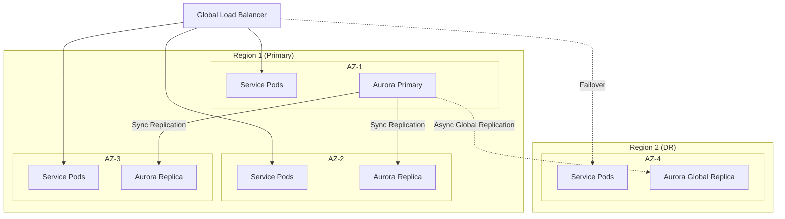

**High Availability (Requirement 11):**
- 3 AZ deployment with automatic failover < 30 seconds
- Aurora Global Database: RPO = 0 for single-node/zone failure (sync replication)
- Cross-region: RTO < 15 minutes, async replication
- 99.99% uptime target (< 4.38 min downtime/month)

**Auto-Scaling (Requirement 11.2):**
- HPA: min 2, max 10 replicas per service, target CPU 70%
- Flash sale detection: custom metrics trigger pre-scaling to 20x baseline within 60s
- Fallback: rate limiting if scaling fails within 60s — Requirement 11.7

**Kubernetes Manifests:**
```yaml
# HPA Configuration (per service)
apiVersion: autoscaling/v2
kind: HorizontalPodAutoscaler
metadata:
  name: storefront-api-hpa
spec:
  scaleTargetRef:
    apiVersion: apps/v1
    kind: Deployment
    name: storefront-api
  minReplicas: 2
  maxReplicas: 10
  metrics:
    - type: Resource
      resource:
        name: cpu
        target:
          type: Utilization
          averageUtilization: 70
    - type: Pods
      pods:
        metric:
          name: http_requests_per_second
        target:
          type: AverageValue
          averageValue: "1000"
```

### Deployment Pipeline

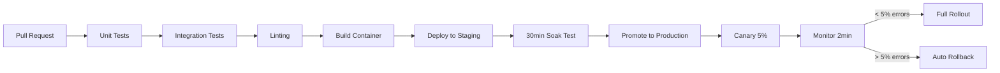

**CI/CD (Requirements 18, 13.5):**
- PR checks: unit + integration + lint < 10 minutes — Requirement 20.4
- Staging deploy within 15 minutes of merge — Requirement 18.3
- Canary/blue-green with 2-minute observation window
- Auto-rollback on > 5% error rate — Requirements 13.5, 18.5
- Production promotion after 30-minute soak with < 1% errors — Requirement 18.7

### Terraform Structure

```
terraform/
├── modules/
│   ├── networking/       # VPC, subnets, security groups
│   ├── database/         # Aurora cluster, read replicas
│   ├── kubernetes/       # EKS cluster, node groups
│   ├── messaging/        # MSK Kafka / SQS queues
│   ├── storage/          # S3 buckets, CloudFront
│   ├── cache/            # ElastiCache Redis cluster
│   ├── search/           # OpenSearch domain
│   ├── monitoring/       # CloudWatch, Prometheus
│   └── dns/              # Route53, ACM certificates
├── environments/
│   ├── dev/
│   ├── staging/
│   └── production/
└── global/               # Shared state, IAM, KMS
```

- Remote state with locking (S3 + DynamoDB) — Requirement 18.1
- Structurally identical environments (differing in sizing) — Requirement 18.4

---

## Security Architecture

### Authentication & Authorization Flow

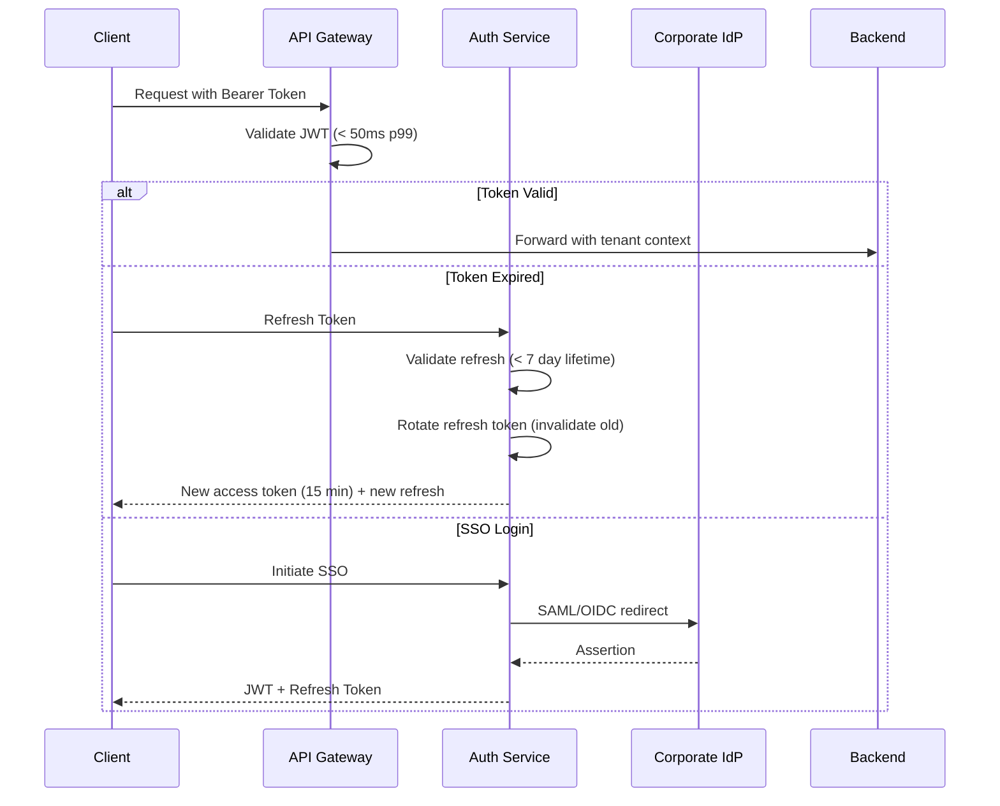

**Token Design (Requirement 21):**
- Access token: JWT, 15-minute expiry, contains `tenant_id`, `user_id`, `role`, `scopes`
- Refresh token: opaque, 7-day max lifetime, single-use with rotation
- Customer session: scoped token, 24-hour lifetime, merchant-specific data only
- MFA required for Owner/Admin roles (TOTP or WebAuthn)

**RBAC Roles (Requirement 21.4):**
| Role | Permissions |
|------|------------|
| Owner | Full account (billing, roles, all operations) |
| Admin | Catalog, orders, staff management |
| Staff | Catalog and order operations |
| Read-Only | View all non-billing data |

### Encryption

- At rest: AES-256 (Aurora encryption, S3 SSE-KMS) — Requirement 12.1
- In transit: TLS 1.3 for external, mTLS for internal gRPC — Requirements 12.2, 30.3
- PCI-DSS Level 1: no raw card data stored; tokenization via Stripe/Adyen — Requirement 12.3

### Audit Logging (Requirement 12.8)

All security-relevant events logged with 12-month retention:
- Authentication failures
- Privilege escalations
- Access to encrypted data stores
- ACL policy changes
- Plugin sandbox violations

---

## Event-Driven Architecture

### Event Topology

```mermaid
graph TD
    subgraph "Producers"
        OrderSvc[Order Service]
        ProductSvc[Product Service]
        CartSvc[Cart Service]
        PaymentSvc[Payment Service]
        AuthSvc[Auth Service]
    end

    subgraph "Message Broker (Kafka)"
        OrderTopic[orders.{tenant_id}]
        ProductTopic[products.{tenant_id}]
        InventoryTopic[inventory.{tenant_id}]
        PaymentTopic[payments.{tenant_id}]
        AuthTopic[auth.events]
    end

    subgraph "Consumers"
        CRM[CRM Service]
        Analytics[Analytics Service]
        Notifications[Notification Service]
        Webhooks[Webhook Service]
        Search[Search Service]
        Whitelabel[Whitelabel Service]
    end

    OrderSvc --> OrderTopic
    ProductSvc --> ProductTopic
    ProductSvc --> InventoryTopic
    CartSvc --> InventoryTopic
    PaymentSvc --> PaymentTopic
    AuthSvc --> AuthTopic

    OrderTopic --> CRM
    OrderTopic --> Analytics
    OrderTopic --> Notifications
    OrderTopic --> Webhooks
    ProductTopic --> Search
    ProductTopic --> Webhooks
    InventoryTopic --> Search
    PaymentTopic --> Analytics
    PaymentTopic --> Notifications
```

**Guarantees (Requirement 19):**
- At-least-once delivery with idempotent consumers — Requirement 19.2
- Delivery within 1 second at ≤ 1000 events/sec — Requirement 19.3
- Retry: 3 attempts with exponential backoff (1s start), then dead-letter queue — Requirement 19.4
- Tenant-partitioned topics for ordered per-tenant processing — Requirement 19.5
- 72-hour retention for unavailable consumers — Requirement 19.6

### Idempotency Pattern

All event consumers implement idempotency using a processed-events table:

```sql
CREATE TABLE processed_events (
    event_id UUID PRIMARY KEY,
    consumer_name VARCHAR(100) NOT NULL,
    processed_at TIMESTAMPTZ NOT NULL DEFAULT NOW()
);
```

Before processing, consumers check if `event_id` exists. This prevents duplicate side effects under at-least-once delivery.

---

## Prototype Phase Architecture

### Simplified Deployment (Requirement 36)

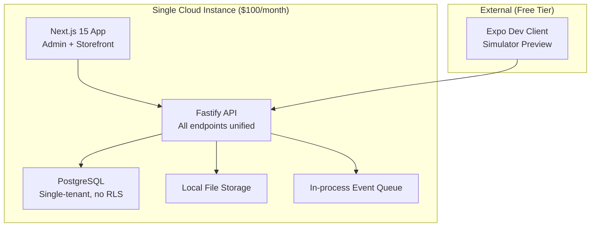

### Prototype vs Production Comparison

| Concern | Prototype | Production |
|---------|-----------|------------|
| **Multi-tenancy** | Single-tenant, no RLS (Req 36.7) | RLS + storage partitioning |
| **Payments** | Simulated gateway (Req 36.8) | Stripe + Adyen, PCI-DSS |
| **Mobile** | Pre-compiled shell + asset injection (Req 36.9) | Full EAS Build pipeline |
| **Storage** | Local filesystem (Req 36.10) | S3 + CloudFront CDN |
| **Analytics** | Pre-seeded demo data (Req 36.11) | Real-time ClickHouse |
| **Deployment** | Single server, no HA (Req 36.12) | Multi-AZ Kubernetes |
| **Auth** | Email/password only (Req 36.13) | OAuth2 + SSO + MFA |
| **Notifications** | Logged to Admin Panel (Req 36.14) | SES/SendGrid + Push |
| **Database** | Single PostgreSQL instance | Aurora Global Database |
| **Message Broker** | In-process event bus | Kafka / SQS |
| **Search** | PostgreSQL full-text search | OpenSearch cluster |
| **Cost** | ≤ $100/month (Req 36.17) | Multi-region production |
| **Team** | ≤ 3 developers (Req 36.16) | Full engineering team |
| **Timeline** | 8 weeks (Req 36.15) | Post-funding |

### Transition Strategy (Requirement 36.19–36.23)

1. **Preserve**: All UI components, design patterns, user journey flows, API contract patterns
2. **Refactor**: Backend infrastructure and data layer only
3. **First task**: Migrate seed data schemas to multi-tenant schema with RLS
4. **Same stack**: TypeScript, Next.js, React Native, Fastify — maximizing code reuse
5. **Prototype seed data**: 2 merchant stores × 20 products each for demo (Requirement 36.18)

---

## Observability

### Monitoring Stack (Requirement 13)

| Component | Tool | Purpose |
|-----------|------|---------|
| Distributed Tracing | OpenTelemetry + Jaeger | Cross-service request tracing |
| Metrics | Prometheus + Grafana | Service health, SLA dashboards |
| Logging | Structured JSON → Loki/CloudWatch | Centralized log aggregation (90 day retention) |
| Alerting | Alertmanager / PagerDuty | Error rate > 1% over 5 min → alert within 60s |

**Key Metrics per Service:**
- Request rate (rps)
- Error rate (%)
- Latency: p50, p95, p99
- CPU utilization (%)
- Memory utilization (%)

---

## Correctness Properties

*A property is a characteristic or behavior that should hold true across all valid executions of a system — essentially, a formal statement about what the system should do. Properties serve as the bridge between human-readable specifications and machine-verifiable correctness guarantees.*

### Property 1: Subdomain Validation

*For any* string input, the subdomain validator SHALL accept the string if and only if it is 3–63 characters long, contains only lowercase alphanumeric characters and hyphens, and starts and ends with an alphanumeric character. All other strings SHALL be rejected.

**Validates: Requirements 1.4**

### Property 2: Tenant Data Isolation

*For any* two distinct tenants A and B, and for any query executed in the context of tenant A against any tenant-scoped table, the result set SHALL contain zero rows where `tenant_id` equals tenant B's identifier.

**Validates: Requirements 2.1**

### Property 3: Catalog Entity Constraint Enforcement

*For any* product creation or listing creation request, the validation layer SHALL accept the request if and only if all fields satisfy their defined constraints: title 1–255 chars, description ≤ 10,000 chars, media count ≤ 50, listings per product ≤ 100, SKU ≤ 64 chars, price 0.01–999,999,999.99, weight 0–1,000,000g, inventory 0–999,999. All requests violating any constraint SHALL be rejected with specific field errors.

**Validates: Requirements 3.1, 3.2, 3.7, 3.8**

### Property 4: SKU Uniqueness Invariant

*For any* set of listings within a single tenant's store, no two listings SHALL have the same SKU value. Any attempt to create a listing with a SKU that already exists within the same store SHALL be rejected with a conflict error.

**Validates: Requirements 3.4**

### Property 5: CSV Import Per-Row Validation

*For any* CSV file containing a mix of valid and invalid product rows, the bulk import processor SHALL produce a per-row validation report where each invalid row is identified with specific field errors, and all valid rows are accepted, without aborting the entire import due to individual row errors.

**Validates: Requirements 3.5**

### Property 6: Cart Constraint Enforcement

*For any* cart state and any add-to-cart operation, the cart service SHALL enforce: maximum 50 distinct line items, maximum 100 units per line item, and inventory availability. Operations violating any constraint SHALL be rejected while preserving the existing cart state unchanged.

**Validates: Requirements 7.1**

### Property 7: Checkout Price Arithmetic

*For any* cart containing line items with prices, applicable tax rates, shipping costs, and discount amounts, the checkout summary SHALL satisfy: `total = subtotal + tax_amount + shipping_amount - discount_amount`, where `subtotal = Σ(unit_price × quantity)` for all line items.

**Validates: Requirements 7.3**

### Property 8: GraphQL Query Depth and Complexity Analysis

*For any* GraphQL query AST, the query analyzer SHALL correctly compute the nesting depth and complexity score, rejecting queries where depth exceeds 10 or complexity exceeds 1000 without executing any resolvers, and accepting all queries within limits.

**Validates: Requirements 8.3, 8.6**

### Property 9: Rate Limiter Sliding Window

*For any* sequence of timestamped requests from a single tenant, the sliding window rate limiter SHALL allow requests within the configured limit (requests per 60-second window) and reject excess requests, such that at no point in time does the count of allowed requests within any 60-second window exceed the tier limit.

**Validates: Requirements 9.3, 9.4, 35.3, 35.4**

### Property 10: Event Consumer Idempotency

*For any* domain event processed N times (where N ≥ 1) by an idempotent consumer, the resulting system state SHALL be identical to the state produced by processing the event exactly once.

**Validates: Requirements 19.2**

### Property 11: Token Rotation Invalidation

*For any* refresh token exchange operation, the newly issued refresh token SHALL be valid and the previously used refresh token SHALL be immediately invalidated such that presenting the old token results in rejection and session invalidation.

**Validates: Requirements 21.3, 21.10**

### Property 12: Coupon Code Validation

*For any* coupon code input, the validation SHALL be case-insensitive (codes differing only in case SHALL match the same promotion) and SHALL accept only strings of 3–32 alphanumeric characters. All other inputs SHALL be rejected with a format validation error.

**Validates: Requirements 23.3**

### Property 13: Discount Stacking Calculation

*For any* cart with multiple applicable discounts and a configured stacking rule, the promotion engine SHALL produce a final discount amount that either equals the best single discount (best-only mode) or the sum of all applicable discounts (combinable mode), and the final price SHALL never be negative.

**Validates: Requirements 23.5**

### Property 14: Currency Conversion Rounding

*For any* price amount and exchange rate, the currency conversion SHALL produce a result equal to `round_half_up(price × rate, 2)`, and for any fixed-price override that exists for the target currency, the fixed price SHALL be returned instead of the computed conversion.

**Validates: Requirements 24.2, 24.3**

### Property 15: Webhook HMAC Signing Round-Trip

*For any* payload bytes and merchant secret, signing the payload with HMAC-SHA256 using the secret and then verifying the resulting signature against the same payload and secret SHALL always succeed. Verifying against a different payload or different secret SHALL always fail.

**Validates: Requirements 28.4**

### Property 16: OTA Code Signing Verification

*For any* update bundle, signing the bundle and then verifying the signature SHALL succeed. Modifying any byte of the signed bundle and then verifying SHALL fail, causing the update to be discarded.

**Validates: Requirements 31.3**

### Property 17: Inventory Allocation Optimization

*For any* set of inventory locations with stock levels and a shipping address, the allocation algorithm SHALL select inventory from the closest location with sufficient stock. When no single location suffices, the algorithm SHALL split across the fewest locations necessary, selecting in order of proximity to the shipping address.

**Validates: Requirements 34.2, 34.3**

### Property 18: Concurrent Inventory Atomicity

*For any* set of concurrent order confirmations against a listing's available inventory, the total quantity successfully allocated across all confirmed orders SHALL never exceed the initial available inventory quantity (no overselling).

**Validates: Requirements 34.4**

---

## Error Handling

### Error Response Contract

All APIs return structured errors following a consistent format:

```typescript
interface ApiError {
  error: {
    code: string;           // Machine-readable error code (e.g., "VALIDATION_ERROR")
    message: string;        // Human-readable description
    request_id: string;     // Correlation ID for tracing
    details?: FieldError[]; // Per-field validation errors
  };
}

interface FieldError {
  field: string;            // Field path (e.g., "listings[0].price")
  constraint: string;       // Constraint violated (e.g., "max_value")
  message: string;          // Description (e.g., "Price must not exceed 999999999.99")
}
```

### Error Categories and Handling Strategies

| Category | HTTP Status | Retry Strategy | Example |
|----------|-------------|---------------|---------|
| Validation | 400 | No retry | Invalid product fields |
| Authentication | 401 | Re-authenticate | Expired/invalid token |
| Authorization | 403 | No retry | Tenant mismatch |
| Not Found | 404 | No retry | Product doesn't exist |
| Conflict | 409 | No retry | Duplicate SKU |
| Rate Limit | 429 | Wait + retry (Retry-After header) | Exceeded tier limit |
| Server Error | 500 | Exponential backoff | Unexpected failure |
| Service Unavailable | 503 | Exponential backoff | Backend down |

### Circuit Breaker Pattern (Requirement 30.5–30.6)

```
States: CLOSED → OPEN → HALF_OPEN → CLOSED
- CLOSED: Normal operation, counting failures
- OPEN: Fail-fast without calling target (after threshold failures)
- HALF_OPEN: Allow single probe request after recovery timeout
- Recovery: threshold 5 failures, timeout 30s (configurable)
- Failure conditions: gRPC UNAVAILABLE, DEADLINE_EXCEEDED, INTERNAL
```

### Retry Policies

| Service | Max Retries | Backoff | Dead Letter |
|---------|------------|---------|-------------|
| Event consumers | 3 | Exponential (1s, 2s, 4s) | DLQ after exhaustion |
| Webhook delivery | 5 | 1m, 5m, 30m, 2h, 24h | Disable after 7 days |
| Email delivery | 3 | Exponential (max 15 min) | Log + alert |
| CRM profile update | 3 | Immediate | Manual reconciliation |
| Payment processing | 0 | N/A (no automatic retry) | Customer-initiated retry |
| Billing charge | 3 | Day 1, Day 3, Day 7 | Account restriction |

### Graceful Degradation

- **Tax/shipping lookup failure**: Use cached rates ≤ 24h, flag order for review — Requirement 33.5
- **Exchange rate provider down**: Use last successful rates, show staleness indicator — Requirement 24.8
- **Mobile app offline**: Display cached data, show connectivity indicator — Requirement 10.5
- **Search service down**: Return empty results gracefully, no error page
- **Analytics pipeline lag**: Dashboard shows staleness indicator, continues serving stale data

---

## Testing Strategy

### Test Pyramid

```
         ╱  E2E Tests  ╲          (Playwright + Detox/Maestro)
        ╱ Integration    ╲         (Contract tests, API tests)
       ╱ Property Tests   ╲        (fast-check, 100+ iterations)
      ╱  Unit Tests        ╲       (Jest/Vitest, 80%+ coverage)
```

### Unit Tests
- **Framework**: Vitest (TypeScript services), Go standard testing (Go services)
- **Coverage target**: > 80% line coverage per service — Requirement 20.1
- **Focus**: Business logic, validation rules, pure functions, error handling
- **Execution**: In PR pipeline, < 10 minutes — Requirement 20.4

### Property-Based Tests
- **Framework**: fast-check (TypeScript), rapid (Go)
- **Minimum iterations**: 100 per property
- **Focus**: Universal properties from the Correctness Properties section
- **Tag format**: `Feature: shopify-clone-saas-platform, Property {N}: {title}`
- **Coverage**:
  - Property 1: Subdomain validation — fast-check string generators
  - Property 2: Tenant isolation — generated tenant data + RLS queries
  - Property 3: Catalog validation — generated product/listing payloads
  - Property 4: SKU uniqueness — generated listing sets
  - Property 5: CSV per-row validation — generated CSV content
  - Property 6: Cart constraints — generated cart operations
  - Property 7: Checkout arithmetic — generated line items + rates
  - Property 8: GraphQL query analysis — generated query ASTs
  - Property 9: Rate limiter — generated request timestamp sequences
  - Property 10: Event idempotency — generated events + replay
  - Property 11: Token rotation — generated auth sequences
  - Property 12: Coupon validation — generated code strings
  - Property 13: Discount stacking — generated discount rule sets
  - Property 14: Currency conversion — generated amounts + rates
  - Property 15: HMAC round-trip — generated payloads + secrets
  - Property 16: Code signing round-trip — generated bundles
  - Property 17: Inventory allocation — generated location/stock configs
  - Property 18: Concurrent inventory — generated concurrent order sets

### Integration Tests
- **Framework**: Pact (contract testing) — Requirement 20.2
- **Focus**: Inter-service API boundaries, database integration, external service mocks
- **Key scenarios**:
  - Storefront API ↔ Product Service contract
  - Order Service ↔ Payment Service contract
  - Webhook delivery to external endpoints
  - Event broker publish/consume cycles

### End-to-End Tests
- **Web**: Playwright — Requirement 20.3
- **Mobile**: Detox or Maestro — Requirement 20.3
- **Critical journeys** (100% pass rate required — Requirement 20.7):
  - Merchant signup → store creation → product setup
  - Customer browse → search → add to cart → checkout → payment
  - Theme selection → preview → publish
  - Mobile app: browse → cart → checkout

### Load Tests
- **Tool**: k6 or Artillery
- **Trigger**: Before each major release — Requirement 20.6
- **Scenarios**: 20x average traffic spikes, p95 < 500ms, error rate < 1%
- **Flash sale simulation**: ramp from baseline to 20x in 60 seconds

### Performance Budgets
| Metric | Target | Measurement |
|--------|--------|-------------|
| Storefront LCP | < 2.5s (p75) | Lighthouse CI on 4G simulation |
| Storefront TTI | < 3.5s (p75) | Lighthouse CI on 4G simulation |
| Storefront CLS | < 0.1 (p75) | Lighthouse CI |
| Storefront API p95 | < 50ms | Prometheus metrics |
| Admin API p95 | < 150ms | Prometheus metrics |
| Search p95 | < 100ms | Prometheus metrics |
| Admin Panel LCP | < 3s | Lighthouse CI on broadband |

---
